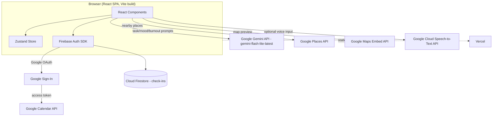

# Paceful

**"Beating Burnout, One Day at a Time"**

A student burnout companion that turns an abstract workload dashboard into a lived-in room — built for **Codenection 2026**, Problem Statement 1: *Stress & Workload Manager*.

| | |
|---|---|
| **Hackathon** | Codenection 2026 |
| **Problem Statement** | PS1 — Stress & Workload Manager |
| **Team** | Yappucino |
| **Team Members** | Hazriq Haykal Norrol Farhan · Siti Fatimah Binti Saniy Wong |
| **University** | Universiti Putra Malaysia (UPM) |
| **Video Presentation** | [Unlisted YouTube Link](#) |
| **Presentation Slides** | [Canva Deck](https://canva.link/pnrmpd5bksjfefa) |
| **Live Demo** | [https://yappucino.vercel.app/](https://yappucino.vercel.app/) |

---

## Table of Contents

1. [Overview](#overview)
2. [The Problem](#the-problem)
3. [Our Solution](#our-solution)
4. [Key Features](#key-features)
5. [What Makes It Different](#what-makes-it-different)
6. [Screens & UI Walkthrough](#screens--ui-walkthrough)
7. [Tech Stack](#tech-stack)
8. [System Architecture](#system-architecture)
9. [Getting Started](#getting-started)
10. [Project Scope](#project-scope)
11. [Ideation & Process](#ideation--process)
12. [Mentor Consultation](#mentor-consultation)
13. [Market Research](#market-research)
14. [Expected Impact](#expected-impact)
15. [Roadmap — What's Next](#roadmap--whats-next)
16. [Team](#team)
17. [References](#references)

---

## Overview

University students juggling academics, part-time work, social obligations, and life admin have no way to see how these pressures stack up together — so they keep saying yes to more, defer what feels "less urgent," and don't realize they're overloaded until they're already burnt out.

**Paceful** (from *"pace"* — a sustainable rhythm — and *"peaceful"* — calm) visualizes a student's workload as an interactive room instead of a dashboard. A personal illustrated buddy lives in that room; tapping a zone opens a life category with a live status card and progress bar. AI-powered reasoning explains *why* a category is overloaded and actively helps the student respond — breaking urgent tasks into steps, reasoning through what can wait, and nudging real-world recovery.

---

## The Problem

University students in Malaysia are experiencing burnout at alarming rates:

- One UPM study of 1,211 students found **60.5%** reported anxiety symptoms, **45.6%** were depressed, and **40%** were stressed (Asia News Network, 2025).
- A cross-sectional study of undergraduates in Perak found poor sleep quality was significantly associated with academic burnout, alongside physical activity and social media use as compounding lifestyle factors — not any single cause (Lim et al., 2025).
- Among medical and health sciences students at UPM specifically, burnout prevalence was **60.1%**, with academic pressure, poor study hours, and role overload as the top contributing factors (Le et al., 2025).
- This mirrors global trends: **43%** of students worldwide experienced academic burnout in 2024, with over **55%** not sleeping enough and **44%** experiencing daily anxiety (Chegg Global Student Survey, 2024).

### Existing solutions fall short

- **Workload/productivity tools** (Notion, Todoist, generic to-do apps) treat every task the same — a checklist to clear — without distinguishing type of load (mental vs. physical vs. social vs. logistical), or acknowledging that burnout comes from *combined* pressure across life areas, not just task volume.
- **Mental health apps** (Calm, Headspace) address symptoms (stress, anxiety) in isolation, disconnected from the actual workload causing them.
- **No existing tool** shows students their combined load across life areas in one place, or actively helps them rebalance rather than just track and report.

---

## Our Solution

Paceful is a student burnout companion that visualizes workload as an interactive room instead of a dashboard. A personal illustrated "buddy" lives in the student's room. Tapping a zone (desk, dumbbell, phone, chore basket) opens that life category — **Study/Work, Health, People, and Chores** — each with a live status card and progress bar showing the load at a glance.

AI-powered reasoning explains why a category is overloaded and actively helps students respond by breaking down urgent tasks into steps, reasoning through what can wait, and nudging real-world recovery. The Community tab suggests real nearby places to help students recharge, and shows anonymized signals of what other students nearby are doing right now — reinforcing that they aren't managing this alone. Beyond day-to-day workload support, Paceful brings mood check-ins, an AI-guided 3-minute reset, and a path to real counseling or wellness support together in a dedicated Support hub.

> **Note on the room itself:** the room illustration is static — it does not visually change based on workload. Load is communicated through status cards and progress bars beneath the room, not through the room's appearance. Room zones are tappable entry points into each category.

---

## Key Features

- **Workload visualiser** across 4 life categories — tap a room zone to open that category, with live status cards and progress bars
- **On-demand burnout check** with Gemini-generated reasoning, delivered via an in-room speech bubble
- **Structure nudge** — urgent tasks broken into actionable sub-steps (sticky-notes UI)
- **Rebalance nudge** — non-urgent tasks deferred with personalized reasoning and defer-count tracking
- **AI insight banner** — a Gemini-generated summary at the top of the Tasks page highlighting the heaviest-loaded category and a suggested next action
- **Community tab** — real nearby places via Google Places for a break, with directions and a map, plus a lightweight anonymized activity feed (with a composer to share your own current activity)
- **Support hub** — daily mood check-in, AI Paceful Buddy insight card, a 3-minute guided reset, a "What do you need right now?" intent menu, and a clear path to real counseling/wellness support
- **Google Calendar sync** — auto-imports events as categorized tasks with AI-inferred priority/load
- **Daily mood check-in**
- **Weekly recap** with AI-generated summary and next-week preview

---

## What Makes It Different

1. **Workload made visible at a glance, not buried in a report.** Each life category is paired with a status card and progress bar next to the student's room. The card state is directly derived from real task data, not decorative.
2. **An AI insight banner that tells you what matters most, not just what's on your plate.** The Tasks page opens with a Gemini-generated summary of the heaviest-loaded category and a suggested next action.
3. **AI reasoning delivered as in-room dialogue, not a report.** The buddy explains overload in a warm, conversational speech bubble generated by Gemini from the student's actual tasks.
4. **Urgency-branching nudges, not one-size-fits-all task management.** Urgent tasks get sub-steps; non-urgent tasks get personalized defer reasoning with defer-count tracking, so the tone shifts once something's been pushed back repeatedly — a deliberate anti-procrastination design.
5. **Calendar sync that understands your schedule, not just imports it.** Gemini classifies each imported event's category, priority, and workload automatically.
6. **A weekly reflection loop, not just daily snapshots.** Each check-in compounds into a Gemini-generated Weekly Recap with a light preview of what's coming.
7. **Community tab tied to real, local places and real peers.** Real nearby recovery spots via Google Places, alongside a lightweight, anonymized sense of shared experience.
8. **A Support hub that leads with something useful, not a directory.** Opens with a mood check-in and an immediate 3-minute reset, with professional support available as an escalation path — not the whole page.
9. **Combined, cross-category load visibility.** No existing tool (productivity, mental health, or calendar apps) shows a student their combined load across academic, physical, social, and logistical life areas in one place.

### Comparison Matrix

| Feature | Notion | Calm / Headspace | Paceful |
|---|---|---|---|
| Shows combined load across life categories | No (tasks only) | No (not workload-aware) | **Yes** |
| Explains why something feels overloaded | No | No | **Yes** (AI reasoning) |
| Actively suggests rebalancing, not just tracking | No | No | **Yes** |
| Connects to real-world recovery (places, directions) | No | No | **Yes** |
| Bridges to real mental health professionals | No | Partial (self-guided only) | **Yes** |
| Visual, emotionally engaging representation | No (lists/boards) | Partial (calming UI, not workload-tied) | **Yes** (room/buddy) |

---

## Screens & UI Walkthrough

> Add screenshots to `docs/screenshots/` and update the image paths below.

**Meet Your Buddy — Character Customisation**

Students shape their companion before anything else happens in the app — choosing a form (Blob, Puff, Sprout, Cloud), a colour, and an optional accessory (Beanie, Glasses, Headphones), then naming it. This buddy later delivers every burnout check and nudge, making those messages feel personal rather than like system alerts.

**Room Overview & Add Task**

A static illustrated space with four fixed zones: desk = Study/Work, dumbbell = Health, phone = People, chore basket = Chores. Workload is shown via the overall progress bar and per-category cards beneath the room. Tapping a zone opens a task modal to log a title, urgency, an effort-load slider, and an optional due date.

**Buddy Check-in + Weekly Recap**

Tapping the buddy triggers an on-demand burnout check — Gemini reasons over the student's actual tasks and responds via a warm speech bubble. The Weekly Recap does the same reasoning at a wider scale: a summary of the week just passed plus a light preview of what's coming.

**Tasks Page & Nudge Detail**

Opens with an AI insight banner summarizing the heaviest-loaded category and a suggested action. Below it, Google Calendar Sync auto-imports events as tasks with AI-inferred categories, priorities, and workload.

- **Structure Nudge** (urgent tasks): Gemini breaks the task into concrete sub-steps (sticky-note list) so the student knows exactly what to do first.
- **Rebalance Nudge** (non-urgent tasks): Gemini gives a personalized reason it's okay to defer, and tracks defer count so the tone gets gentler-but-firmer the more it's deferred.

**Community Page**

Shows anonymous, aggregate activity from nearby students (e.g. *"12 students studying around Faculty of Computing"*), paired with a real suggested nearby spot to recharge. Deliberately not a social network — no profiles, friend lists, or messaging.

**Support Page**


| Section | Description |
|---|---|
| How Are You Feeling? | One-tap mood check-in (Good, Okay, Tired, Stressed, Overwhelmed) that personalizes everything below it |
| Your Paceful Buddy | Contextual message reacting to current workload, with quick actions to start a reset or view full workload |
| 3-Minute Reset | Short self-regulation activities (Breathing, Stretch, Drink water, Step away from screen, Mindfulness), each with a timer |
| What Do You Need Right Now? | Intent-based routing tiles (Calm down, Talk, Take a break, Work feels overwhelming) |
| Need Someone to Talk To? | Bridge to real professional support — university counselling/student support services |

---

## Tech Stack

| Layer | Tech | Why | Constraint |
|---|---|---|---|
| **Frontend** | React 18, TypeScript, Vite, Tailwind CSS, Zustand, Framer Motion | Vite for fast SPA dev/iteration; Zustand for simple state with no boilerplate; Framer Motion for smooth animations | Tailwind pinned to v3 to avoid mid-hackathon migration risk |
| **Backend** | Firebase (Auth + Firestore), no custom server | Narrow needs (auth + check-ins); no time to build/host a custom API | API keys ship client-side; mitigated with HTTP-referrer key restrictions, not a proxy |
| **Database** | Cloud Firestore | NoSQL fits flat check-in data, zero-ops | Tasks live in Zustand (session-only), not yet persisted — scope cut |
| **AI Reasoning** | Google Gemini API (`gemini-flash-lite-latest`) | Powers nearly every "smart" feature: category/priority inference, burnout detection, task breakdown, rebalancing, recovery/support suggestions, check-in replies | Switched models after the first choice had 2–23s latency; each call now uses a timeout with one automatic retry, and fallback text only appears on genuine API failure |
| **Location/Maps** | Google Places API (New) + Maps Embed API | Real nearby spots for Community and Support suggestions, map + directions | Needs 2 separate, differently-restricted API keys |
| **Calendar** | Google Calendar API (OAuth) | Bundled into Google Sign-In, auto-syncs on login | — |
| **Voice Input** | Google Cloud Speech-to-Text API | Optional voice input on the daily check-in's "What's on your mind?" field | Minor/supporting feature, not core to the AI reasoning pipeline |
| **Hosting** | Vercel | Zero-config static/SPA hosting with automatic deploys from Git | Google OAuth (Sign-In + Calendar sync) is not yet configured for the deployed domain — prototype phase |
| **Cross-cutting** | — | — | All calls metered on free tier; Places API requires Cloud Billing linked |

---

## System Architecture

The frontend (React SPA) communicates directly with each service — there is no intermediary custom backend server between them. This is a deliberate, disclosed architectural choice appropriate to hackathon scope.



- Frontend ↔ Firebase Authentication (Google Sign-In)
- Frontend ↔ Cloud Firestore (check-ins)
- Frontend ↔ Google Gemini API (task/mood/burnout reasoning)
- Frontend ↔ Google Places API (nearby recovery spots)
- Frontend ↔ Google Maps Embed API (map preview)
- Google Sign-In ↔ Google Calendar API (auto-sync on login)
- Frontend ↔ Google Cloud Speech-to-Text API (optional voice input on daily check-in)
- Static build deployed to Vercel

---

## Getting Started

**The fastest way to try Paceful is the live demo: [https://yappucino.vercel.app/](https://yappucino.vercel.app/)** — no setup required.

> **Note:** Google OAuth (Sign-In and Google Calendar sync) is not yet configured for this prototype, so those specific features won't work on the live demo. Everything else — Room, Tasks (manual entry), Community, and Support — is fully usable. The local setup below is only needed if you want to run or modify the project yourself.

### Prerequisites

- Node.js 18+
- A Firebase project (Auth + Firestore enabled)
- API keys/credentials for: Google Gemini, Google Places (New), Google Maps Embed, Google Calendar OAuth client, Google Cloud Speech-to-Text (optional)

### Installation

```bash
git clone <repository-url>
cd paceful
npm install
```

### Environment Variables

Create a `.env` file in the project root:

```bash
VITE_FIREBASE_API_KEY=
VITE_FIREBASE_AUTH_DOMAIN=
VITE_FIREBASE_PROJECT_ID=
VITE_FIREBASE_APP_ID=

VITE_GEMINI_API_KEY=

VITE_GOOGLE_PLACES_API_KEY=
VITE_GOOGLE_MAPS_EMBED_API_KEY=

VITE_GOOGLE_CALENDAR_CLIENT_ID=

VITE_GOOGLE_SPEECH_API_KEY=
```

> Places and Maps Embed require **separate, differently-restricted** API keys — a key restricted to Places will be rejected by the Maps Embed iframe, and vice versa.

### Run locally

```bash
npm run dev
```

### Build for production

```bash
npm run build
```

### Deploy

The live demo is deployed on [Vercel](https://vercel.com), which builds and deploys automatically from this repository — no manual deploy step needed.

---

## Project Scope

### In Scope (implemented and tested)

- Task creation using a fixed four-category model, with Gemini-based category mismatch detection
- Google Calendar OAuth integration with automatic event sync, Gemini classifying category/priority/workload
- Interactive Room interface with category status cards, interactive AI Buddy, and navigation across Room, Tasks, Community, and Support
- Gemini-based burnout/workload analysis, structure nudges, and rebalance nudges, with fallback responses
- Daily mood check-ins with Gemini-generated responses stored in Firestore
- Real-world recovery suggestions via Google Places, maps, directions, and completion tracking
- Gemini-generated Weekly Recap summaries and next-week previews
- Support Hub: mood check-in, AI Buddy insights, short recovery activities, personalised support routing
- AI Task Insights identifying the user's most heavily loaded category
- Community: activity feed and post creation using seeded/local content for the current prototype

### Out of Scope (current build)

- Persistent task storage in Firestore (currently session-local Zustand state)
- Server-side API key management and rate limiting
- Push notifications beyond the browser Notification API
- Automated CI-based testing (validation via manual and scripted functional testing)
- University or Moodle portal integration — a visual connection interface only demonstrates intended functionality; see [Roadmap](#roadmap--whats-next)
- Precise real-time location tracking — Community activity data is designed to remain approximate and anonymised

---

## Ideation & Process

### Ideas We Considered

| Idea | Why dropped / kept |
|---|---|
| **Room-based buddy companion (Chosen)** | Turns an abstract workload dashboard into something students actually feel — a lived-in space instead of numbers. Maps naturally to categories through tappable zones, and ties recovery completion to real-world action, not just passive tracking. |
| SkyLoad — weather-metaphor concept (Dropped, but foundational) | Workload shown as changing weather. Kept the insight that load should feel ambient, not numeric, but dropped the framing — a single "sky" couldn't show multiple categories at once, and lacked personal warmth. |
| 5 categories: Mental/Time/Physical/Social/Errands (Dropped, refined into 4) | Mental and Time overlapped too heavily (a deadline task is usually also a mental-load task). Merged into "Study/Work." |
| Standalone AI chatbot (Dropped) | Addresses stress in isolation, like existing apps (Calm, Headspace), without tying back to the actual workload causing it. |
| Generic to-do list with load percentages (Dropped) | Too close to existing tools (Notion, Todoist). Just tracks and reports rather than helping students act. |
| Manual category dropdown on task entry (Dropped) | Forced users to self-diagnose which category their problem belonged to. Replaced with zone-tap entry + a lightweight Gemini mismatch-check. |
| Fixed task deferral with no reasoning shown (Dropped) | Silently pushing back tasks risked enabling avoidance. Replaced with urgency-branching + Gemini-generated reasoning per defer. |

### Ideation Boards

- **Paceful Problem Tree** — maps root causes (academic pressure, poor sleep, low activity, financial burden, social media, no combined visibility) through the core problem (students don't recognize overload until it's too late) to real effects (anxiety, depression, stress, declining performance). This directly shaped the decision to build a multi-category workload visualiser rather than a single-metric tracker.
- **Paceful Idea Evolution Flowchart** — traces SkyLoad (weather-metaphor concept) → the pivot → Hazriq's room-based buddy concept → the merged concept → Paceful (final), alongside dropped ideas along the way (generic to-do list, standalone chatbot, 5-category model, manual category dropdown, fixed task deferral).
- Full-resolution PDF of both diagrams: *[link]*

---

## Mentor Consultation

**Date:** 8 September 2026 · **Mentor:** Lim Zi Yang

| Feedback Received | What Was Changed |
|---|---|
| The problem statement and solution feel disconnected — a third party can't trace why this specific problem leads to this specific solution and feature set. | Restructured the pitch deck so each core feature ties back to a specific research finding (e.g. burnout comes from multiple compounding life areas → 4-category workload visualiser instead of one score; existing apps only track and report → active nudges instead of passive tracking). |
| Consider integrating with university student portals (e.g. Moodle) so assignments sync automatically instead of manual entry. | Agreed and currently exploring implementation. Depends on the university platform's available integration capabilities (APIs/SDKs, authentication/SSO). Tracked as an exploratory roadmap item — see [Roadmap](#roadmap--whats-next) — not claimed as built. |
| Gemini's task categorization only used the task/event title, giving it limited context. | Began extending calendar-imported tasks to pass event description, location, and duration to Gemini, not just the title. Early results were inconsistent, so this is tracked as a roadmap item rather than claimed as complete. |
| Replace percentage-only load display with something more visual, like a progress bar. | Updated the 4 category cards on the Room page to show a filled progress bar alongside the percentage. |
| Recovery Nudge could include light community input (why a place is good), without becoming a full social platform. | Built further than originally scoped: the Community tab now includes a lightweight activity feed and a composer for students to share their own current activity — anonymized and approximate, still no profiles or private messaging. |
| Deck needs more market framing — why would a student choose to download this. | Added a Market Research section: target user, why Paceful over Notion/Todoist/Calm/Headspace, and why now (rising burnout stats). |
| Several slides read as too text-dense. | Rewrote text-heavy slides into shorter icon/fragment format instead of full sentences. |

Even where the team agreed with the direction of a piece of feedback, several items were consciously scoped as future vision rather than built into this prototype/building-phase submission — stated plainly rather than glossed over, since a realistic build boundary is more useful to reviewers than an overclaim.

---

## Market Research

### Market Size

Phased expansion strategy:

- **Malaysia:** ~1.2 million higher education students (Ministry of Higher Education Malaysia, 2024)
- **Southeast Asia:** ~90 million higher education students (UNESCO, 2026)
- **Global:** ~269 million higher education students (UNESCO, 2026)

Initial focus is Malaysia, followed by Southeast Asia and the global market as the solution expands.

### Target Users

University students managing multiple responsibilities — academic work, part-time employment, social commitments, and personal tasks. Malaysian university students are the primary target market, with potential applicability globally. Approximately **6 in 10** Malaysian university students experience some form of mental health challenge (Arifin et al., 2023).

### Competitive Positioning

Existing applications generally focus on either productivity or mental well-being — Notion/Todoist manage tasks, Calm/Headspace focus on stress and relaxation. Paceful differentiates by combining workload management, well-being monitoring, AI-assisted insights, and recovery recommendations within a single platform.

### Market Opportunity

The increasing prevalence of student burnout and growing adoption of AI-powered applications create an opportunity for Paceful. By connecting students' workload with their well-being, Paceful aims to provide more personalised support for managing academic and personal responsibilities.

---

## Expected Impact

Paceful aims to create impact at three levels:

### Individual Student
Helps students recognise the accumulation of workload across study, health, social activities, and daily responsibilities. Workload visibility, personalized AI guidance, task rebalancing, and recovery suggestions support better decisions about time and responsibilities, and healthier workload management habits.

### University
Supports universities in promoting student wellbeing by providing an accessible first layer of workload and wellbeing support. Future integration with systems such as Moodle could incorporate academic deadlines automatically, giving a more complete picture of students' academic workload and better connections to existing counselling and student support services.

### Society
Encourages a healthier culture around student wellbeing by normalising breaks, recovery, and seeking support when needed. Through community features, students see that others are also managing academic and personal pressures — reducing the feeling that they have to handle everything alone.

---

## Roadmap — What's Next

Based on feedback from the [mentor consultation](#mentor-consultation) and team discussion, the following improvements have been identified for the building phase.

### Confirmed Enhancement Directions

- **AI Buddy:** Introduce text-to-speech for voice-based buddy responses
- **Task Management:** Improve category mismatch detection and task input flow
- **Burnout and Workload Nudges:** Enhance Gemini reasoning and provide more varied personalised recommendations
- **AI Task Insights:** Develop trend-based insights using multiple user check-ins
- **Weekly Recap:** Introduce visual week-to-week comparisons and shareable or exportable summaries
- **Community:** Replace seeded content with a live backend supporting cross-user activity sharing
- **Calendar Inference:** Improve workload classification by incorporating event descriptions, locations, and duration in addition to event titles
- **Check-In Streaks & Badges:** Introduce daily check-in streaks and achievement badges

### Exploratory Direction (Future Plan)

- **University Portal Integration:** Explore integration with university learning platforms such as Moodle to automatically synchronise assignments and deadlines. Feasibility remains subject to institutional API or SSO access, compatibility, and university approval. *This is not a committed building-phase feature.*

---

## Team

| Name | Role |
|---|---|
| Hazriq Haykal Norrol Farhan | Team Yappucino |
| Siti Fatimah Binti Saniy Wong | Team Yappucino |

Universiti Putra Malaysia (UPM)

---

## References

Arifin, S., Abdullah, S. S., Omar, N. E., Mohamed, N., Yusop, Y. M., & Hadi, N. M. H. (2023). The prevalence of mental health among Malaysian university students. *International Journal of Academic Research in Business and Social Sciences, 13*(12), 391–400. https://doi.org/10.6007/IJARBSS/v13-i12/19796

Asia News Network. (2025, June). *Constant pressure to succeed, outdo peers cause Malaysian university students to suffer from stress, burnout.* https://asianews.network/constant-pressure-to-succeed-outdo-peers-cause-malaysian-university-students-to-suffer-from-stress-burnout/

Chegg, Inc. (2025). *Chegg Global Student Survey 2025.* https://www.chegg.org/global-student-survey-2025

Le, L. J., Mansor, F. A., Manogar, K. R., & Adam, S. K. (2025). Association of social support and burnout among undergraduate medical and health sciences students at a Malaysian university. *Health Professions Education, 11*(1), Article 12. https://doi.org/10.55890/2452-3011.1323

Lim, K. E. J., Cheah, K. J., Abdul Latif, F. A., & Mohd Shahrin, F. I. (2025). Academic burnout and its association with sleep quality, physical activity, and social media addiction among university students in Perak, Malaysia: A cross-sectional study. *Makara Journal of Health Research, 29*(2), 80–86. https://doi.org/10.7454/msk.v29i2.1845

UNESCO. (n.d.). *Number of students in higher education more than doubled in 20 years, but inequalities remain.* https://www.unesco.org/en/articles/number-students-higher-education-more-doubled-20-years-inequalities-remain

---

<p align="center">Built with 💜 by Team Yappucino for Codenection 2026</p>